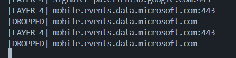

# noAds

- noAds is a project that identifies and blocks any advertisements while enjoying your favourite music on your favourite platforms.

- For a cherry on top, I have also added all useless survey and update connections from Microsoft aswell, because I hate being spied on a local (offline) account.

- This project also runs on community contributions, so please if you find any new nameserver that I might have missed, make a pull request!

- test

### Workflow

- When a connection is made for a nameserver that contains an ad url or a known update connection point from a known provider, the proxy makes the request but sends back a 404 Not Found, hence killing the advertisement and not sending your data over to Microsoft.

- Blocked telemetry: 


### Policy

- The code is completely opensource and I recommend to selfhost on localhost for privacy and anonimity purposes. Anyone who knows anything about privacy and networks would know how much this project can be abused to spy on your private information like credentials and everything, hence I recommend to not trust anyone and self-hosting this project to enjoy everything. 

- [MARKED FOR FUTURE] ~~But if that is too much work for you, I have hosted this on my own website.~~

```bash
REMOVED
```

~~(p.s: I am hosting this in my room, please be gentle with the usage.)~~

### TO-DO

- ~~add layer 7 monitor to block and monitor certain endpoints~~
- add layer 3 monitor to monitor network handshake connections, ICMP echo and ICMP raw
- ~~add custom blocklist for users to block their own custom endpoints and connections~~